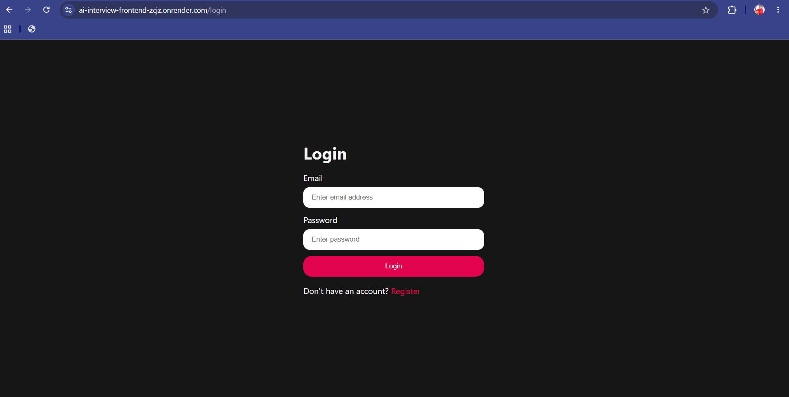
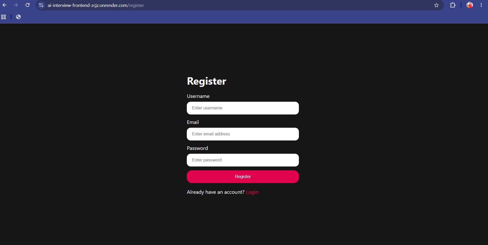
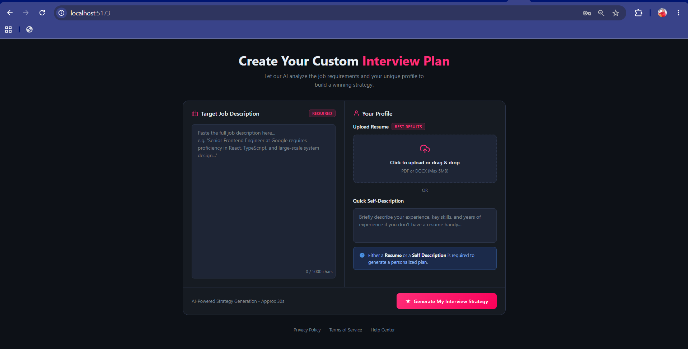

# 🤖 AI Interview Preparation Platform

An AI-powered Interview Preparation Platform built using the MERN Stack and Google Gemini AI. It helps users practice interviews, upload resumes, and receive AI-generated interview reports.

---

## 🚀 Live Demo

### 🌐 Frontend
👉 https://ai-interview-frontend-zcjz.onrender.com

### ⚙️ Backend API
👉 https://ai-interview-backend-av5f.onrender.com

---

## ✨ Features

- 🔐 User Authentication (Register & Login)
- 📄 Resume Upload (PDF)
- 🤖 AI-Powered Interview Report Generation
- 📊 Match Score Analysis
- 💡 AI-Based Interview Suggestions
- 📱 Responsive User Interface
- ☁️ Full Stack Deployment on Render

---

## 🛠️ Tech Stack

### Frontend
- React.js
- Vite
- Sass (SCSS)
- Axios

### Backend
- Node.js
- Express.js
- MongoDB
- JWT Authentication
- Google Gemini AI

---

## 📂 Project Structure

```text
AI-Interview-Preparation-Platform/
├── Backend/
│   ├── src/
│   ├── server.js
│   └── package.json
├── Frontend/
│   ├── src/
│   ├── public/
│   └── package.json
└── README.md
```

---

## ⚙️ Installation

### Clone the Repository

```bash
git clone https://github.com/visual2364/AI-Interview-Preparation-Platform.git
```

### Backend Setup

```bash
cd Backend
npm install
npm start
```

The backend requires the variables shown in `Backend/.env.example`. Copy that file to `Backend/.env`, then set real values for `MONGO_URI`, `JWT_SECRET`, and `GOOGLE_GENAI_API_KEY`. Keep `.env` files private. `FRONTEND_URL` must be the exact frontend origin (scheme and hostname, no path); `PORT` is supplied by Render in production.

### Frontend Setup

```bash
cd Frontend
npm install
npm run dev
```

The frontend runs at `http://localhost:5174` and reads `VITE_API_URL` from `Frontend/.env`. Copy `Frontend/.env.example` to `Frontend/.env`. Set `VITE_API_URL=http://localhost:3000` for local development. Vite embeds this value in the browser bundle, so it must contain only the public backend base URL, never a secret.

## Production Deployment

Deploy `Backend` and `Frontend` as separate services. Configure the backend service with root directory `Backend`, build command `npm install`, and start command `npm start`. Configure the frontend service with root directory `Frontend`, build command `npm install && npm run build`, and publish directory `dist`.

Set these backend environment variables in Render:

- `MONGO_URI`: MongoDB Atlas connection string. Add the Render service's outbound IPs or the appropriate Atlas network access rule.
- `JWT_SECRET`: a long, randomly generated secret.
- `GOOGLE_GENAI_API_KEY`: a Google AI Studio API key.
- `FRONTEND_URL`: the deployed frontend origin, for example `https://your-app.onrender.com`.
- `NODE_ENV=production`.
- `PORT` is provided by Render; do not hard-code it.

Set `VITE_API_URL` in the frontend hosting provider to the deployed backend origin, for example `https://your-api.onrender.com`, then redeploy the frontend so Vite rebuilds with that value. The backend enables credentialed cookies and only allows the configured frontend origin plus localhost development origins. Production authentication requires HTTPS. For static hosting, configure SPA fallback so unknown paths serve `index.html`.

Resume uploads accept PDF files up to 3 MB. The generated resume PDF feature also requires Chromium available to Puppeteer on the backend host.

---

## 📸 Screenshots

### 🔐 Login Page



---

### 📝 Register Page



---

### 📊 Dashboard



---

## 👨‍💻 Author

**Vishal Singh**

- GitHub: https://github.com/visual2364
- Live Demo: https://ai-interview-frontend-zcjz.onrender.com

---

## ⭐ Support

If you like this project, consider giving it a ⭐ on GitHub.
